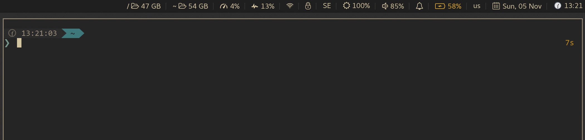

# YubiKey touch detector

This is a tool that can detect when YubiKey is waiting for your touch. It is designed to be integrated with other UI components to display a visible indicator.

For example, an integration with [i3wm](https://i3wm.org/) and [py3status](https://github.com/ultrabug/py3status) looks like this:



*See also: [FAQ: Which UI components are already integrated with this app?](#faq-existing-ui-integrations)*


## Installation

The app is available as an AUR package: **TODO**

Alternatively install it with `go`:

```
$ go get -u github.com/maximbaz/yubikey-touch-detector
```

This places the binary in your `$GOPATH/bin` folder, as well as the sources in `$GOPATH/src` for you to use the detection functions in your own code.


## Prerequisites

<a name="prerequisites-pam-u2f"></a>

#### If you use `pam-u2f`:

- [maximbaz/pam-u2f](https://github.com/maximbaz/pam-u2f) - a patched version of `pam-u2f` that adds touch notifications. Patched version of the last official release v1.0.4 [is also available](https://github.com/maximbaz/pam-u2f/tree/pam_u2f-1.0.4-indicator).


## Usage

#### Command line

To test how the app works, run it in verbose mode to print every event on STDERR:

```
$ yubikey-touch-detector -v
```

Now try different commands that require a physical touch and see if the app can successfully detect them.

#### Integrating with other UI components

First of all, make sure the app is running (e.g. wrap it in a systemd user service).

Next, in order to integrate the app with other UI components to display a visible indicator, use any of the available notifiers in the `notifier` subpackage.

For example, `notifier/unix_socket` allows anyone to connect to the socket `$XDG_RUNTIME_DIR/yubikey-touch-detector.socket` and receive the following events:

| event   | description                                        |
|---------|----------------------------------------------------|
| GPG_ON  | when a `gpg` operation started waiting for a touch |
| GPG_OFF | when a `gpg` operation stopped waiting for a touch |
| U2F_ON  | when `pam-u2f` started waiting for a touch         |
| U2F_OFF | when `pam-u2f` stopped waiting for a touch         |


## How it works

Your YubiKey may require a physical touch to confirm these operations:

- `sudo` request (via `pam-u2f`)
- `gpg --sign`
- `gpg --decrypt`
- `ssh` to a remote host (and related operations, such as `scp`, `rsync`, etc.)
- `ssh` on a remote host to a different remote host (via forwarded `ssh-agent`)

*See also: [FAQ: How do I configure my YubiKey to require a physical touch?](#faq-configure-yubikey-require-touch)*

#### Detecting a sudo request (via `pam-u2f`)

In order to detect when `pam-u2f` requests a touch on YubiKey, you first need to install [prerequisites for `pam-u2f`](#prerequisites-pam-u2f).

With that in place, `pam-u2f` will open `$HOME/.config/Yubico/u2f_keys` every time it starts and stops waiting for a touch.

This app will thus watch for `OPEN` events on that file, and when event occurs will toggle the touch indicator.

### Detecting gpg operations

This detection is based on a "busy check" - when the card is busy (i.e. `gpg --card-status` hangs), it is assumed that it is waiting on a touch. This of course leads to false positives, when the card is busy for other reasons, but it is a good guess anyway.

In order to not run the `gpg --card-status` indefinitely (which leads to YubiKey be constantly blinking), the check is being performed only after `$HOME/.gnupg/pubring.kbx` file is opened (the app is thus watching for `OPEN` events on that file).

### Detecting ssh operations

The requests performed on a local host will be captured by the `gpg` detector. However, in order to detect the use of forwarded `ssh-agent` on a remote host, an additional detector was introduced.

This detector runs as a proxy on the `$SSH_AUTH_SOCK`, it listens to all communications with that socket and starts a `gpg --card-status` check in case an event was captured.


## FAQ

<a name="faq-configure-yubikey-require-touch"></a>

#### How do I configure my YubiKey to require a physical touch?

For `sudo` requests with `pam-u2f`, please refer to the documentation on [Yubico/pam-u2f](https://github.com/Yubico/pam-u2f) and online guides.

For `gpg` and `ssh` operations, install [ykman](https://github.com/Yubico/yubikey-manager) and use the following commands:

```
$ ykman openpgp touch sig on   # For sign operations
$ ykman openpgp touch enc on   # For decrypt operations
$ ykman openpgp touch aut on   # For ssh operations
```

Make sure to unplug and plug back in your YubiKey after changing any of the options above.

<a name="faq-existing-ui-integrations"></a>

#### Which UI components are already integrated with this app?

- [py3status](https://github.com/ultrabug/py3status) provides an indicator for [i3wm](https://i3wm.org/) via a `yubikey` module.
